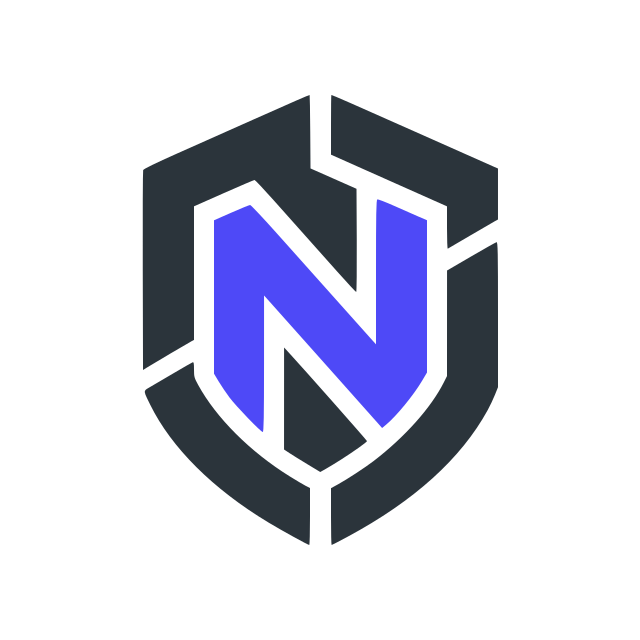

  

<h1 align="center">NoemaLabs</h1>

  Smart contract security for growing Web3 teams.

  
  
  

 

## About Us

NoemaLabs is a dedicated smart contract security research team founded by two brothers with a shared goal: helping Web3 teams ship safer protocols.

Our work is founder-led and research-first. We combine exhaustive manual review with AI-assisted checks to understand protocol design, implementation logic, integrations, and edge-case behavior across DeFi, infrastructure, and cross-chain systems.

We believe good security work is not just a checklist. It comes from taking the time to understand each protocol's invariants, communicate clearly with the team, and deliver findings that are practical to fix.

 

## Findings Summary

<table align="center">
  <tr>
    <td align="center">
      <strong>62</strong>
       
      <strong><big>High Findings</big></strong>
    </td>
    <td align="center">
      <strong>36</strong>
       
      <strong><big>Medium Findings</big></strong>
    </td>
  </tr>
</table>

 

## Public Findings Ledger

| Contest | Platform | Placement | Findings | Date | Report |
| --- | --- | --- | --- | --- | --- |
| Daao-contracts | Cantina | 1st | 8 H, 1 M | Jan 2025 | TBA |
| [LiquidRon](https://code4rena.com/reports/2025-01-liquid-ron) | Code4rena | 1st | 1 H, 2 M | Jan 2025 | [Report](https://code4rena.com/reports/2025-01-liquid-ron) |
| [vVv Launchpad - Investments & Token distribution](https://github.com/sherlock-protocol/sherlock-reports/blob/main/audits/2024.11.17%20-%20Final%20-%20vVv%20Launchpad%20-%20Investments%20%26%20Token%20distribution%20Audit%20Report.pdf) | Sherlock | 1st | 1 H | Nov 2024 | [Report](https://github.com/sherlock-protocol/sherlock-reports/blob/main/audits/2024.11.17%20-%20Final%20-%20vVv%20Launchpad%20-%20Investments%20%26%20Token%20distribution%20Audit%20Report.pdf) |
| [EigenLayer Contracts](https://cantina.xyz/portfolio/263f2eb5-c89e-4788-9026-e0e453d91c39) | Cantina | 3rd | 1 M | May 2025 | [Report](https://cantina.xyz/portfolio/263f2eb5-c89e-4788-9026-e0e453d91c39) |
| Cross Chain Realitio | Hats | 3rd | TBA | Sep 2025 | TBA |
| [Superform Core](https://cantina.xyz/portfolio/94cba55c-a593-4798-9866-a573a734738d) | Cantina | 4th | 2 H, 2 M | May 2025 | [Report](https://cantina.xyz/portfolio/94cba55c-a593-4798-9866-a573a734738d) |
| [Desk Orderbook](https://cantina.xyz/portfolio/5c335680-b1a3-4d45-8948-bcc18c53a6f3) | Cantina | 4th | 2 M | Jan 2025 | [Report](https://cantina.xyz/portfolio/5c335680-b1a3-4d45-8948-bcc18c53a6f3) |
| Uniswap Unistaker Infrastructure | Code4rena | 4th | 1 L | Feb 2024 | TBA |
| Telcoin Platform Audit | Sherlock | 5th | 2 H, 1 M | Jan 2024 | [Report](https://github.com/sherlock-protocol/sherlock-reports/blob/main/audits/2024.01.15%20-%20Final%20-%20Telcoin%20Platform%20Audit%20Audit%20Report.pdf) |
| [Doppler Contracts](https://cantina.xyz/portfolio/263f2eb5-c89e-4788-9026-e0e453d91c39) | Cantina | 6th | 4 H | Jan 2025 | [Report](https://cantina.xyz/portfolio/263f2eb5-c89e-4788-9026-e0e453d91c39) |
| SuperDCA Liquidity Network | Sherlock | 6th | 3 H, 2 M | Sep 2025 | TBA |
| [Kelp DAO \| rsETH](https://code4rena.com/reports/2023-11-kelp) | Code4rena | 9th | 3 H | Nov 2023 | [Report](https://code4rena.com/reports/2023-11-kelp) |
| [OP Labs Safe Extensions](https://cantina.xyz/portfolio/1b6a9e55-49a8-46e9-8272-a849fd60fcc4) | Cantina | 10th | 2 M | May 2024 | [Report](https://cantina.xyz/portfolio/1b6a9e55-49a8-46e9-8272-a849fd60fcc4) |
| [Decent](https://code4rena.com/audits/2024-01-decent) | Code4rena | 10th | 3 H | Jan 2024 | [Report](https://code4rena.com/audits/2024-01-decent) |
| Burve | Sherlock | 13th | 1 H | Apr 2025 | TBA |
| Zetachain | Sherlock | 25th | 1 H, 4 M | Aug 2024 | TBA |
| [Revolution](https://code4rena.com/reports/2023-12-revolutionprotocol) | Code4rena | 30th | 2 M | Dec 2023 | [Report](https://code4rena.com/reports/2023-12-revolutionprotocol) |
| [Folks Finance](https://reports.immunefi.com/folks-finance-staking-contracts?utm_source=boost_program_page&_gl=1*1yt5yi8*_gcl_au*MjYzOTM0MTY1LjE3NzQ4NjY4NDc.*_ga*MTU2ODI1ODYyMS4xNzY1NjA5NDA2*_ga_JPHMK6RZT0*czE3NzkxNzA0NTIkbzY2JGcxJHQxNzc5MTcwNTMwJGo2MCRsMCRoMTQ1NDc3NDg1OQ..) | Immunefi | 46th | 1 L | Mar 2026 | [Report](https://reports.immunefi.com/folks-finance-staking-contracts?utm_source=boost_program_page&_gl=1*1yt5yi8*_gcl_au*MjYzOTM0MTY1LjE3NzQ4NjY4NDc.*_ga*MTU2ODI1ODYyMS4xNzY1NjA5NDA2*_ga_JPHMK6RZT0*czE3NzkxNzA0NTIkbzY2JGcxJHQxNzc5MTcwNTMwJGo2MCRsMCRoMTQ1NDc3NDg1OQ..) |
| Chainlink Staking v0.2 | Code4rena | TBA | 1 M, 1 L | Aug 2023 | TBA |

 

## Private Audits

| Audit | Provider | Date | Report |
| --- | --- | --- | --- |
| Bio Security Review | Pashov Audit Group | Dec 2025 | [Report](https://github.com/pashov/audits/blob/master/team/pdf/Bio-security-review_2025-12-15.pdf) |
| Private Audit | Pashov Audit Group | Private | Private |
| Private Audit | Pashov Audit Group | Private | Private |

 

## Work With Us

For audit requests, send repo access, commit hash, docs, scope notes, and target delivery window.

- Telegram: [@NoemaLabs](https://t.me/NoemaLabs)
- X: [@NoemaLabs](https://x.com/NoemaLabs)
- Website: [noemaxlabs.com](https://noemaxlabs.com)
- Aamir: [@ua1552](https://twitter.com/ua1552)
- Aasif: [@Aasif1552](https://twitter.com/Aasif1552)
